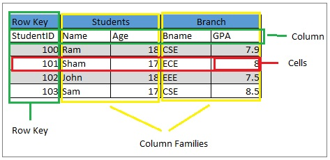
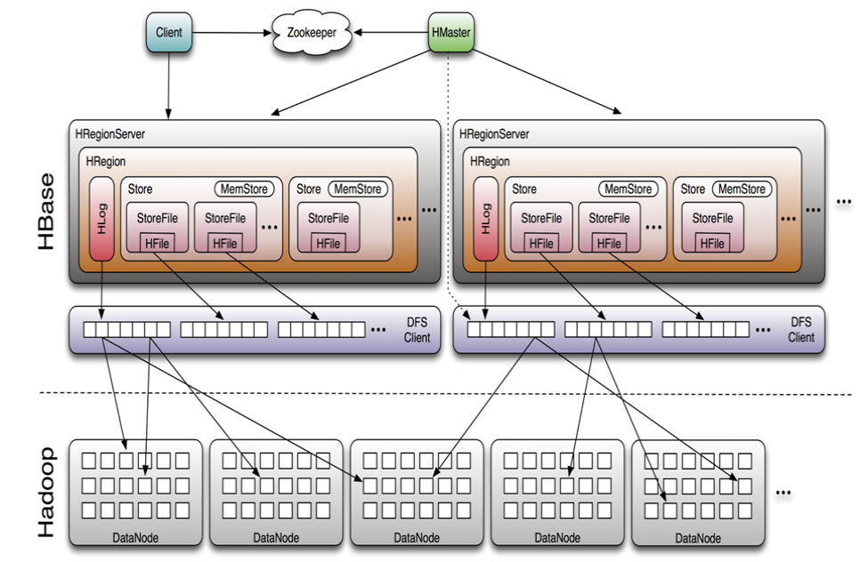

# NoSQL with HBase

## NoSQL definition

- **Key-value**:
  - 1 key = 1 value
  - Examples : Redis, Memcache (in memory)
- **Wide-column**:
  - each column or column family is stored separately
  - Examples : Apache HBase, Apache Cassandra (ScyllaDB)
- **Document stores**:
  - JSON/XML like objects
  - Examples : MongoDB, CouchDB
- **Graph**:
  - Store nodes and relationships (edges) between them
  - Examples : Neo4j, JanusGraph

## Apache HBase

- _Apache HBase™ is the Hadoop database, a distributed, scalable, big data store_ ([hbase.apache.org](hbase.apache.org))
- Random, realtime read/write access to Big Data.
- Inspired from Google BigTable paper (2006).
- Relies on HDFS for storage.

## HBase: introduction

- The CAP theorem (covered in Big Data introduction).
- HBase is a **CP columnar** database.
- Conversely, [Apache Cassandra](https://cassandra.apache.org) focuses on AP.

## HBase: data structure

- A table is a collection of rows.
- A row has several **column families** defined at table creation.
- A column family has **any number of columns**.
- Logicial representation of 1 row.
  ```json
  {
    "key_1": {
      "column_family_1": { "col_1": "a", "col_2": "b"},
      "column_family_2": { "col_3": "c", "col_4": "d"}
    }
  }
  ```
  OR its flatten representation.
  ```text
  key_1 > column_family_1 > col_1 : "a"
  key_1 > column_family_1 > col_2 : "b"
  key_1 > column_family_2 > col_1 : "c"
  key_1 > column_family_2 > col_2 : "d"
  ```
- Physical representation of 1 row.
  ```text
  |---------------------|    |---------------------|
  |   column_family_1   |    |   column_family_2   | 
  |=====================|    |=====================|
  | key_1 > col_1 : "a" |    | key_1 > col_1 : "c" |
  | key_1 > col_2 : "b" |    | key_1 > col_2 : "d" |
  |---------------------|    |---------------------|
  ```



## HBase: data storage

- Data is stored:
  - In HDFS in the **HFiles**.
  - In RAM in the **Memstore**.
- Tables are split into **regions**:
  - 1 region = all rows in a certain **range of keys**.
  - The number of regions depends on the size of the table.



## HBase: architecture

- **HBase Master**
  - Handle table creation/deletion queries.
  - **Assigns regions** to RegionServers and monitor them.
- **RegionServer**
  - 1 region of a table is managed by 1 RegionServer.

## HBase: data storage in RegionServers

1. On data write:
   - Storing in the **Memstore in RAM**.
   - Storing in the **HLog in HDFS** (Write Ahead Log).
2. When the Memstore or the HLog reaches max size: flush to **HFile in HDFS** (1 per CF). Temporary **compactions**.
3. If the RegionServer crashes, operations are replayed from the HLog for the Memstore and metadata loaded from the HFile (by another RegionServer).

## HBase: partition tolerance and HA

- RegionServers tracked by ZooKeeper:
  - On crash, HMaster knows it through ZooKeeper.
  - HMaster re-assigns regions to other RegionServers.
- High Availability: multiple HBase Masters.

## HBase: querying

- HBase client
  - CLI
  - Languages / tools (e.g. NiFi)
- Apache Phoenix, SQL on HBase (in memory)
- Apache Hive

---

*The content of this document, including all text, images, and associated materials, is the exclusive property of Adaltas and is protected by applicable copyright laws. Unauthorized distribution, reproduction, or sharing of this content, in whole or in part, is strictly prohibited without the express written consent of the author(s). Any violation of this restriction may result in legal action and the imposition of penalties as prescribed by law.*
