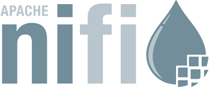
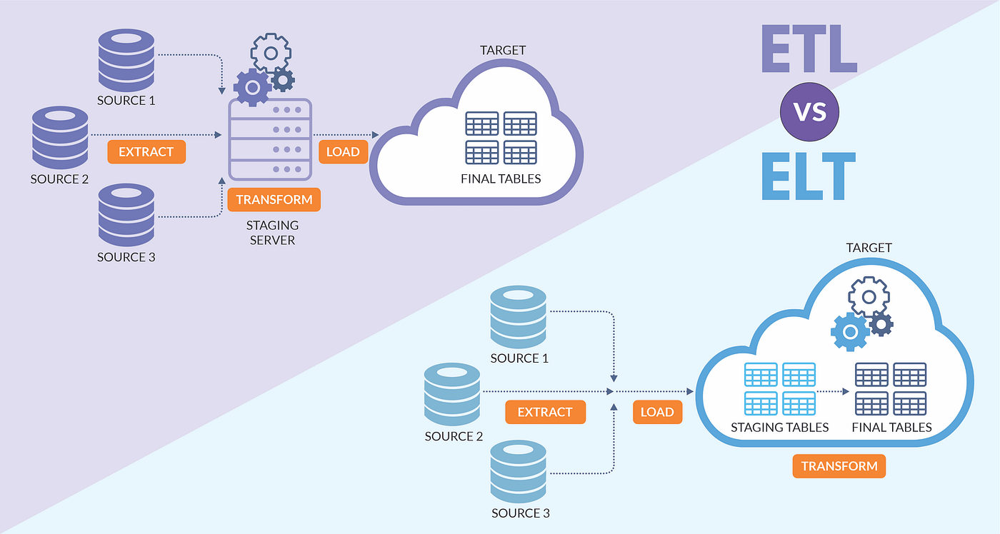
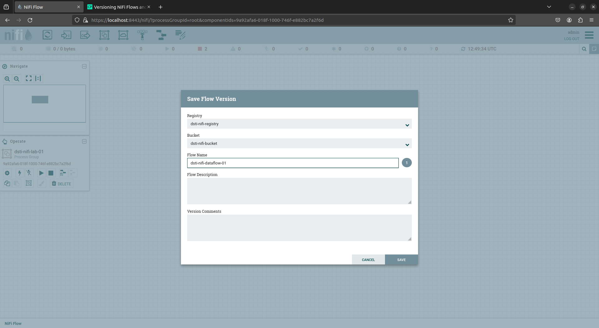
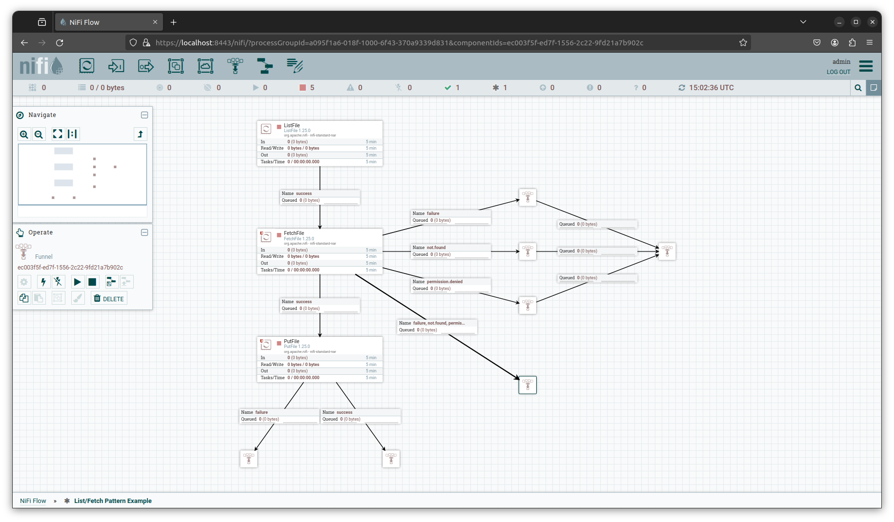

# Dataflow with Nifi

Apache NiFi is an open source data ingestion and integration tool designed to automate the flow of data between systems. The web-based UI is intended to make it easy for users to create, monitor, and control the flow of information.

<figure style="margin: 0 auto">
  
</figure>

## Intro to Dataflow

### What is Dataflow?

Dataflow can be a broad concept, but at a high level, it is simply the automated and managed flow of information between systems.  

### ETL

Extract, Transform, Load (ETL) is a process where data is fetched/retrieved from a source. The data goes through needed transformations such as data validation, cleaning, joining data from multiple sources, etc, before being loaded to its final target.  

### ELT

In Extract, Load, Transform (ELT) data is fetched/retrieved from a data source. It is then loaded/dumped into a target system where jobs are run to further transform the data. This process also allows for simplified archiving of the original data.

<figure style="text-align: center">
  
  <figcaption>ETL vs ELT pipeline diagram</figcaption>
</figure>

## History

NiFi was initially developed by the U.S. National Security Agency (NSA) starting around 2006 and was open sourced to Apache community in 2014.

 > Project NiFi set out to address what were understood to be 'critical gaps' in traditional systems where other solutions lacked:  
    - sufficient security,  
    - interactivity,  
    - scalability and,  
    - data lineage/provenance i.e. a data life-cycle measure detailing data's origins & why, how and where it moves over a period of time.

> [NSA 'NiFi' Big Data Automation Project Out In The Open](https://www.forbes.com/sites/adrianbridgwater/2015/07/21/nsa-nifi-big-data-automation-project-out-in-the-open/)

## NiFi Key Features

### Security

- allows for fine-grained security control
- various levels of security including:
   - system to system
   - User to system
   - multi-tenant

### Ease of Use

- Guaranteed Delivery
- Web-based low/no code interface
- CLI tools/Rest API
- [Data Provenance/Data Lineage](https://www.nnlm.gov/guides/data-glossary/data-provenance)
- Live indicators

### Extensible

- components are customizable and easy to load in
- because of the way NiFi implements its component system, the added components  can be built with little concern over conflicts with another extension

### Scalable Flow Management

- Scale out with clustering
   - Add more nodes to cluster
   - Site-to-Site cluster connections
- Scale-up and down by tuning the flows
   - Buffering and Back Pressure/Release (settings configured in connection)
   - Prioritized Queuing
   - Flow Specific [QoS](https://en.wikipedia.org/wiki/Quality_of_service)
   
## NiFi Architecture

### Web Server

The web-server serves the NiFi UI, which is the main point of interaction for building flows.  

### Flow Controller

The Flow Controller is the brains of the operation. It maintains knowledge of Processors and Connections (among other things), and acts as a broker facilitating the exchange of  FlowFiles between processors.

### Storage

- FlowFile Repository: stores the attributes/metadata of the file
- Content Repository: stores the payload (file content)
- Provenance Repository: stores the data provenance for the flow file

<figure style="text-align: center">
  
  <figcaption>NiFi Single Node</figcaption>
</figure>

### Clustering

> Starting with the NiFi 1.0 release, a Zero-Leader Clustering paradigm is employed. Each node in a NiFi cluster performs the same tasks on the data, but each operates on a different set of data. Apache ZooKeeper elects a single node as the Cluster Coordinator, and failover is handled automatically by ZooKeeper. All cluster nodes report heartbeat and status information to the Cluster Coordinator. The Cluster Coordinator is responsible for disconnecting and connecting nodes. Additionally, every cluster has one Primary Node, also elected by ZooKeeper. As a DataFlow manager, you can interact with the NiFi cluster through the user interface (UI) of any node. Any change you make is replicated to all nodes in the cluster, allowing for multiple entry points.

[NiFi-overview](https://nifi.apache.org/docs/nifi-docs/html/overview.html#nifi-architecture)

<figure style="text-align: center">
  
  <figcaption>NiFi Cluster</figcaption>
</figure>

## NiFi Extended Ecosystem

**NiFi Registry:** Complementary application that provides a centralized repo for flow storage and management across one or multiple instances of NiFi.   

- Registry is the main/suggested/preferred method for sharing and versioning data flows.
- A secondary option, Templates, is available in NiFi 1.x versions but has been deprecated as of NiFi 2.0.

<figure style="text-align: center">
  
  <figcaption>NiFi Cluster</figcaption>
</figure>

**MiNiFi:** NiFi sub-project with a lightweight footprint designed to live directly at the source of data creation.

**NiFi C2 Server:** Command and control. Provides orchestration for MiNiFi agents.

## NiFi Core Concepts

### FlowFile

A FlowFile represents a data object moving through the system and is made up of three parts:

- Attributes: metadata about the file.
- Payload: content of file.
- Provenance: information about the movement of the data through the system.

### FlowFile Processor

A FlowFile Processor is a single unit of work in the NiFi system designed to perform some function with the data such as data fetching, data validation, data routing, etc.

### Connection

In NiFi a connection is the link or between processors. They act as queues and can be configured to regulate the movement of data through the system.

### Funnel

A funnel in NiFi is a component that is used to combine the data from several connections into a single connection.

Funnels also provide a convenient endpoint for flow debugging and development.

<figure style="text-align: center">
  
  <figcaption>Funnel</figcaption>
</figure>

### Process Group

Process Groups organizes components/flows into logical groups allowing the creation of complex organizations. They facilitate the creation of security policies.

## Considerations When Using NiFi

NiFi is an extremely powerful tool. It is relatively easy to set up and includes nearly 400 supported processors with the base install. Due to the easily extensible nature of NiFi's design, if some combo of the base processors doesn't solve a problem, it is possible for users to code and include their own processors. Getting started with NiFi is easy, but it is a complex tool to master. Some considerations to keep in mind.

- The sheer number of processors means there are countless ways to solve a problem, but it is sometimes hard to stumble on the best/most efficient way to solve the problem.
- Besides the number of ways to solve a problem, there are also the settings that need to be tuned to control how the data flows through NiFi.
- With the flexibility and the granular control offered, not having all of the pieces dialed correctly may lead to flows that take minutes (or longer) instead of milliseconds.
- NiFi can be made to do almost anything imaginable but may not be the best tool for the job. For instance, NiFi can be used to do light data transformations and data enrichment, but heavier transformations such as complex joins are better left to more specialized tools.

## Resources

[Apache NiFi Overview](https://nifi.apache.org/docs/nifi-docs/html/overview.html#nifi-architecture)  
[Everything Apache NiFi Gihub Repo](https://github.com/tspannhw/EverythingApacheNiFi?tab=readme-ov-file)  
[NiFi Contact Information](https://nifi.apache.org/community/contact/)

---

*The content of this document, including all text, images, and associated materials, is the exclusive property of Adaltas and is protected by applicable copyright laws. Unauthorized distribution, reproduction, or sharing of this content, in whole or in part, is strictly prohibited without the express written consent of the author(s). Any violation of this restriction may result in legal action and the imposition of penalties as prescribed by law.*
