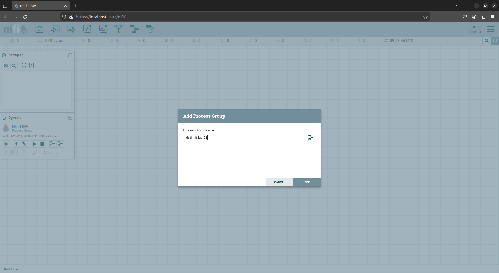
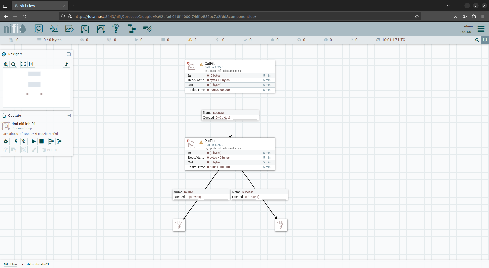
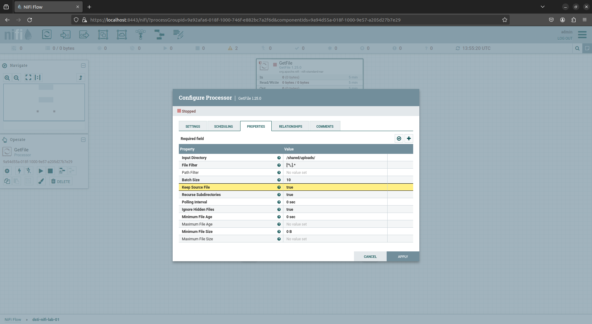
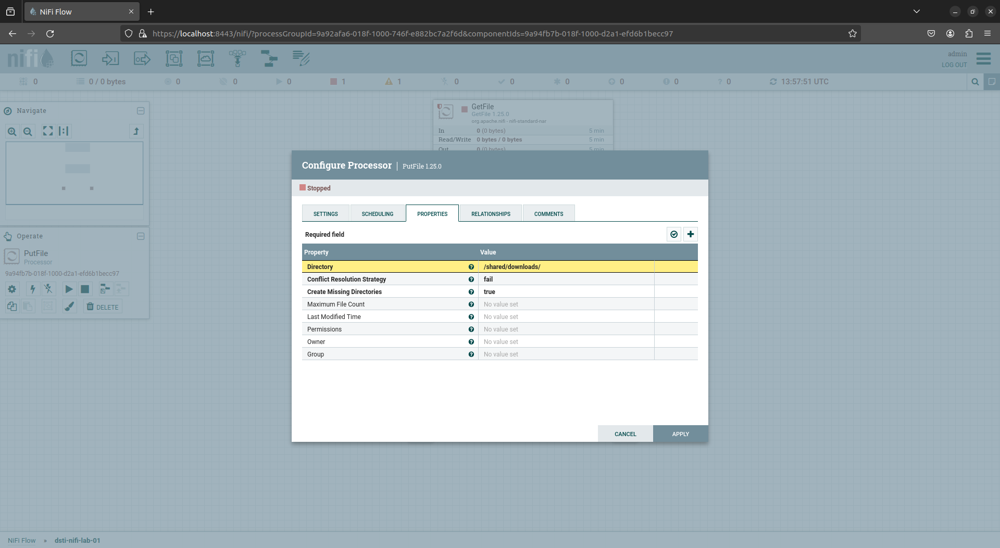

# Lab: Introduction to NiFi

## Objectives

- Become familiar with the NiFi ui
- Create basic NiFi dataflow
- Version our first flow with NiFi-Registry

## Tasks

1. Set up the environment (Easy)
2. Get to know the NiFi ui (Easy)
3. Build first flow (Easy/Medium)
4. Version first flow (Easy/Medium)
5. Bonus (Varying)

## Prerequisites

Start a new project directory and add two sub-directories, `./source` and `./sink`. Make sure to be in the base level of the project directory when you start the lab. Add a "hello-nifi.txt" file to your base directory and copy it to the source directory. PLEASE NOTE: IT IS VERY IMPORTANT TO ENSURE THAT YOU ARE IN AN EMPTY DIRECTORY WHEN LAUNCHING YOUR DOCKER CONTAINER! This lab will be demonstrating how to use NiFi to automatically move files, and as such it is VERY IMPORTANT to ensure you are only moving the files intended ("hello-nifi.txt").  

```bash
cd ./01.nifi-dataflow/

mkdir source && mkdir sink

vim ./source/hello-nifi.txt
```

## 1. Set up the environment

For the NiFi Labs, we will be setting up and utilizing two Docker containers, [NiFi](https://hub.docker.com/r/apache/nifi) and [NiFi-Registry](https://hub.docker.com/r/apache/nifi-registry).  
*Note*: If needed, you can review the Docker commands with `docker --help`, `docker run --help`, and/or [here: Ultimate Docker Cheat Sheet](https://dockerlabs.collabnix.com/docker/cheatsheet/) and [here: Docker Reference-Running Containers](https://docs.docker.com/engine/reference/run/)

1. Ensure that you are in the project directory that you created in the prerequisites. DO NOT SKIP THE STEP OF SETTING UP A NEW EMPTY PROJECT DIRECTORY FOR THIS LAB!
2. Run NiFi Docker image with the following command:

```bash
# Start the NiFi container for the first timme
docker run --name nifi-126 \
--publish 8443:8443 \
--env NIFI_WEB_HTTPS_PORT='8443' \
--env SINGLE_USER_CREDENTIALS_USERNAME=<username> \
--env SINGLE_USER_CREDENTIALS_PASSWORD=<password> \
--mount type=bind,source=$(pwd),target=/shared \
--detach \
apache/nifi:1.26.0

# NOTE: Please note that the password must be 12 characters minimum, otherwise NiFi will generate a random username and password. See secure.sh and start.sh scripts for supported environment variables.
```

Access the NiFi ui here: https://localhost:8443/nifi/login

3. Run The NiFi-Registry Docker image with the following command:

```bash
# Start the NiFi-Registry container for the first time
docker run --name nifi-registry-126 \
--publish 18080:18080 \
--detach \
apache/nifi-registry:1.26.0
```

Access the NiFi-Registry ui here: http://localhost:18080/nifi-registry

4. In a terminal run `docker inspect nifi-registry-126` and make note of the "Gateway" ip.
5. Open settings (wrench icon located in the top right corner)
6. Create `NEW BUCKET`.
7. Open NiFi ui and open `Controller Settings` (accessed through the hamburger in the top right corner of the UI).
8. Open the Registry Clients tab and add a new Registry Client (the + button).
9. Edit the client property to add the registry URL (http://172.17.0.1:18080).

## 2. Get to know the NiFi ui

1. Review the following sections of the [NiFi User Guide](https://nifi.apache.org/docs/nifi-docs/html/user-guide.html):

   - [NiFi User Interface](https://nifi.apache.org/docs/nifi-docs/html/user-guide.html#User_Interface)
   - [Building a DataFlow: Adding Components to the Canvas:](https://nifi.apache.org/docs/nifi-docs/html/user-guide.html#adding-components-to-the-canvas) 
      - Processor
      - Funnel
      - Process Group

2. Log into the NiFi ui here: https://localhost:8443/nifi/login and spend some time exploring the ui.

## 3. Build a flow

Here we're going to create our first very simple flow consisting of only two processors to move a file from a source to a destination/sink.

1. Open the NiFi ui and create your first process group by dragging a process group onto the main canvas.  



2. Double click the process group to open
3. Add a new processor to the canvas called 'GetFile'
4. Add a new processor to the canvas called 'PutFile'
5. Create a 'success' connection between GetFile and PutFile (this is the only relationship type for the GetFile processor)
6. Add two 'Funnel's to the canvas below the PutFile processor. Note that this is not the main use for funnels but provides a nice place holder for processor relationships until we've decided what we want to happen with the relationship. Additionally, it will provide a visual aid for ensuring our flows are functioning the way that they are intended.
7. Add a failure relationship from PutFile processor to a funnel and a success relationship to the other funnel.  



8. Configure the GetFile processor to "get" files from your `./source` directory.
9. While configuring the GetFile processor it is important to note that the 'Keep Source File' setting defaults to 'false'. This means that once the processor has gotten the file, it will attempt to delete the origin file. For now we'll leave this setting as false.



10. Configure the PutFile processor to "put" files in your `./sink` directory.



11. Right click on the GetFile processor and start it. You should soon see your file queued in the success relationship between GetFile and PutFile
12. Right click on and start the PutFile processor
13. You should soon see a file queued in the success relationship between the PutFile processor and the funnel. You can also check the sink directory to make sure the file is there.  

## 4. Version the flow

1. Find documentation on versioning NiFi with NiFi-Registry and version your flow.

## 5. Bonus

- Copy the hello-nifi.txt file to the source directory again. Does the flow behave as expected? (Easy)
   - If the flow doesn't behave as expected, find out why and explore the ways you can manipulate the behavior. (Medium)
- Add "code comments" to your data flow by utilizing `Labels`. (Easy)
- Spin up an SFTP server and create a new flow to move a file from the SFTP server to your sink directory. (Hard)
- Review the video [Get vs. List/Fetch and Using A Record Writer](https://www.youtube.com/watch?v=7mbxJxjGj3w) to learn more about NiFi and why the basic flow implemented above is not the recommended method for moving data from source. (Easy)
