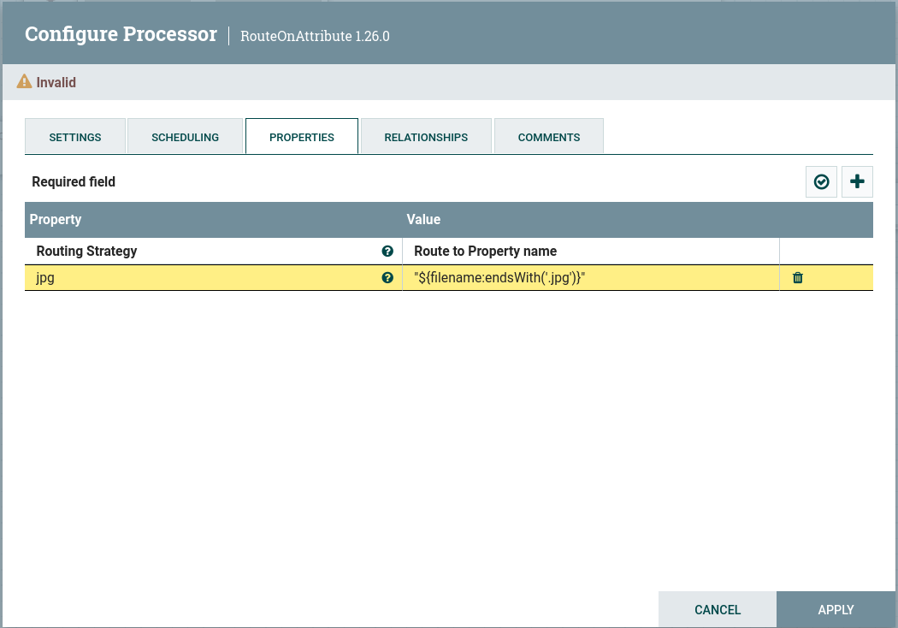
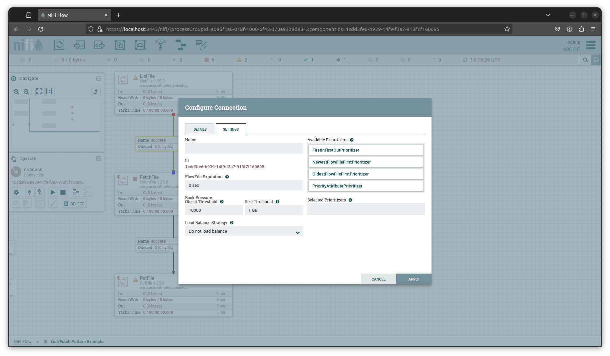

# NiFi usages

The NiFi UI provides an intuitive and easy to use interface for building dataflows.  

## User Interface

**Components Bar:** The components used in building flows. Hovering over a component on the toolbar displays its name.  
**Global Menu:** Contains options for manipulating the existing components on the canvas. Additionally selecting the Help option pulls up documentation for the current version of NiFi.  
**Status Bar:** Provides Global Flow information like number of threads in use, size of data, processor/component info, etc.  
**Navigate Pallette:** Provides convenient ways to navigate the flow such as zooming.  
**Operate Pallette:** Provides information about the currently selected component.  

<figure style="text-align: center">
  
  <figcaption>NiFi User Interface</figcaption>
</figure>

## NiFi Component Overview

- **Processors:**  
  The Processor is the most commonly used component, as it is responsible for data ingress, egress, routing, and manipulating.
- **Input Port:**  
  Pipes FlowFiles into process group.
- **Output Port:**  
  Pipes FlowFiles out of process group.
- **Process Groups:**  
  Used to logically organize flows. Flows are versioned/shared at the Process Group level.
- **Remote Process Group:**  
  Treats external NiFi clusters as just another process group.
- **Funnel**  
  Combine the data flow from several connections into a single connection, also provide a convenient endpoint for debugging and development.
- **Template:**  
  An alternative method for sharing flows. It has been removed as of Nifi 2.0 and is not recommended for use in older versions of NiFi if NiFi Registry is available.
- **Labels:**  
  Used to provide quick flow documentation.

## Processor configuration

**Settings:** Provides options for naming the processor. 

- **Penalty Duration:** FlowFile level. An amount of time added to the FlowFile that indicates how long to pause the processing of that FlowFile after a problem has been encountered.
- **Yield Duration:** Processor level. The amount of time a processor will pause execution if problem is encounterd
- **Bulletin level:** This setting indicates the lowest level of Bulletin that should be shown in the User Interface. By default, the Bulletin level is set to WARN, which means it will display all warning and error-level bulletins.

**Scheduling:**

- **Scheduling strategy:** Timer or CRON Job. Simple timer is default. CRON job provides more control at the expense of complexity for configuration
- **Concurrent Tasks:** Essentially number of FlowFiles processed at the same time. Increases resource use by a given processor. 
- **Run Duration:** How long a processor runs before passing FlowFiles to next destination. Dial to control latency vs. throughput.

**Properties:**

Configure the processor specific behavior. Properties are specific to each processor. There are a couple of features that may be encountered when configuring the properties of a processor that are worth noting:

- **Controller Service(s):** these provide processor group level ways of handling various files. An example might be a combo of Read/Write processors. The Read processor is configured to read a specific file format such as json. The write processor is configured to output the data in a specified format. So one could use the processor to Read a file in json and output the file in CSV, Avro, Orc, etc.
- **NiFi Expression Language:** The [NiFi Expression Language](https://nifi.apache.org/docs/nifi-docs/html/expression-language-guide.html) provides a NiFi specific way for working with and manipulating FlowFile Attributes. For example, we could use the expression `"${filename:endsWith('.jpg')}"
  ` with a RouteOnAttribute processor to images in the flow.

  <figure style="text-align: center">
    
    <figcaption>RouteOnAttribute example</figcaption>
  </figure>

**Relationships:**

Relationships are the different output states for processor. States are specific to each processor but some are commonly available.  

- **terminate:** FlowFile is removed from flow and processing is considered complete
- **retry:** configurable with number of attempts and amount of time between each attempt before routing file forward

Note that if a relationship is auto terminated and retried, the retry cycle will complete before the process is auto-terminated.

## Connection configuration

**Details:** General information about the relationship.  
**Settings:**  
- **FlowFile Expiration:**
  Data can be aged out of the flow, default value of `0` means the file never expires.
- **Available Prioritizers:**  
  Defaults to OldestFlowFileFirst (oldest in dataflow).
- **Back Pressure:**  
  Provides both object and total size thresholds.
- **Load Balance:**  
  Distribute the load accross the cluster.

<figure style="text-align: center">
  
  <figcaption>NiFi Connection Configuration</figcaption>
</figure>

---

*The content of this document, including all text, images, and associated materials, is the exclusive property of Adaltas and is protected by applicable copyright laws. Unauthorized distribution, reproduction, or sharing of this content, in whole or in part, is strictly prohibited without the express written consent of the author(s). Any violation of this restriction may result in legal action and the imposition of penalties as prescribed by law.*
