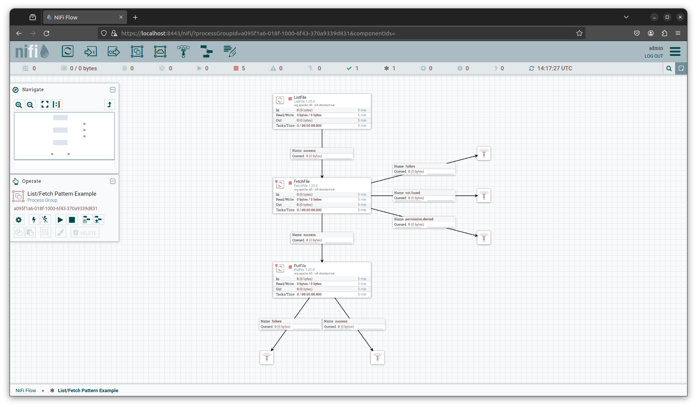

# Lab: Building Better Dataflows

In this lab we are going to revisit and improve the simple NiFi flow we set up during the introduction to NiFi lab.

## Objectives

- Practice importing and versioning of dataflows
- Build a better understanding of basic NiFi functionality
- Build more complex dataflows
- Build a complete pipeline

## Tasks

1. Import a Dataflow (Easy)
2. Improve the Dataflow (Easy)
3. Debug a Dataflow (Easy/Medium)
4. Send a Notification (Easy/Medium)
5. Build an error handling flow (Hard)

## Prerequisites

- Completion of NiFi basics Lab

## 1. Import a Dataflow 

1. Add a new 'Process Group' to the canvas
   - Add Process Group Name ex: List/Fetch Pattern Example.
   - Click 'Import from Registry' and import the flow saved during the last lab.
   - Right click on the Process Group and under the 'Version' option select 'Stop Version Control'
   - Start new version control for this process group.

## 2. Improve the Dataflow  

While the original flow works, it is not the best (nor recommended) way to retrieve files from a source. In the next steps we will update our data retrieval from a 'Get' processor to a 'List/Fetch' combination.

2. Add a new processor to the canvas called 'ListFile'.
3. Add a new processor to the canvas called 'FetchFile'.
4. Add three funnels to the canvas that we will utilize as placeholders for FetchFile relationships we do not yet have a plan for.
5. Right click on the 'PutFile' processor we configured during the first lab, select the copy option, and paste a copy of the processor below the processors for our new flow. (This will allow us to easily utilize the same configurations for this processor we set up previously)
7. Create a success relationship between ListFile and FetchFile.
8. Create a success relationship between FetchFile and PutFile. 
11. Configure the flow, taking the time to read the documentation for each processor.
11. Copy the hello-nifi.txt file from your main project directory to the source directory.
12. As we did in the previous lab, start each processor one by one so that we can see the file move through each step of the flow.
13. Once the flow has been tuned and completes successfully, remember to update the flow version!

## 3. Debug a Dataflow 

1. Stop the dataflow.  
2. Learn how to clear the list processor and clear it.  
3. Restart the flow.  
4. What happens and why? 

## 4. Send a Notification

Let's assume the issues encountered above are note worthy enough that someone needs to be notified when it happens. Add an element to your flow to send an email if a file enters a failure relationship. 

## 5. Build an error handling flow 

A file has entered the failure relationship. Other than automatically terminating the failure relationships, what are some other ways to deal with failed files? Imagine a couple of scenarios and build at least one. 

## Bonus

1. Review the following tutorial on the [List/Fetch pattern](https://www.youtube.com/watch?v=7mbxJxjGj3w), making note of the additional pattern that makes use of a `RecordWriter` to provide even better control of the flow. Update your flow to make use of the RecordWriter. (Easy/Medium)  
2. Review the [videos](https://www.youtube.com/watch?v=RjWstt7nRVY) on anti-patterns in NiFi from one of NiFi's co-creators (Easy)
   - replicate one of the flows (Varying)  
3. Review the 'Listing Strategy' on the ListFile processor and learn the different listing strategy methods and how they are implemented. (Easy)
